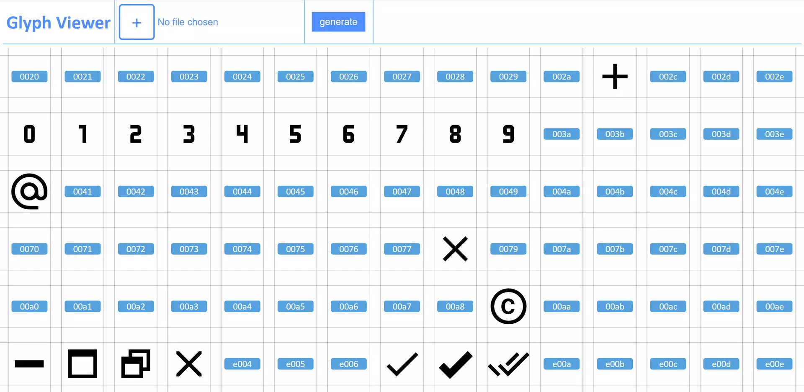

# Icon Manager

The icon **manager** is used to *build* and *manage* SVG icons as well as a custom font using the `fontforge` python module.

### Preview
<div align="center">
    <br/>
    <i>Icon manager view</i>
</div>

### Requirements

- `Python <= 3.0`
- `PHP <= 7.4`
- `FontForge module` (*python3*) <small>`sudo apt-get install fontforge`</small>

### How to use it?

1. **Submodule**<br>
    First, add the repository as a `submodule` to your projects.
    ```bash
    mkdir icons && cd icons
    git submodule add https://github.com/smr76/icon-manager
    ```
2. **Config** (*optional*)<br>
    Set a custom configuration in manager's parent directory and name it `manager.conf` (*if it does not exist, it will be created on launch based on `sample.conf`*).
3. **Launch**<br>
    Finally, execute `launch.sh` to launch the manager.
4. **Add**<br>
    Choose a SVG file and give it a suitable name.
5. **Generate**<br>
    Generate font by clicking `Generate`.

### Tip
To optimize `.svg` files, use **[svgo](https://github.com/svg/svgo)**.<br>
The code below will optimize all `.svg` files in the `../svg` directory, with the option `-p` indicating *2 decimal* precision.
```bash
svgo -p 2 -f ../svg
```

## Dependencies
- [FontForge](https://github.com/fontforge/fontforge) (FontForge)
- [Python]()
- [Php]()